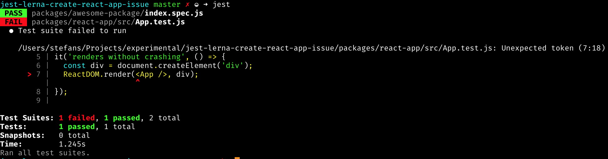

# jest + lerna + create-react-app issue

This repository exists to test and hopefully fix the issue

## tools
* [lerna](https://github.com/lerna/lerna)
* [jest](https://github.com/facebook/jest)
* [create-react-app](https://github.com/facebookincubator/create-react-app)

## The issue
Start with `lerna bootstrap` to get a monorepo. In `packages` is an example package and a react-app.  
Try to run `jest` from the root-directory and will you will get this error.  

